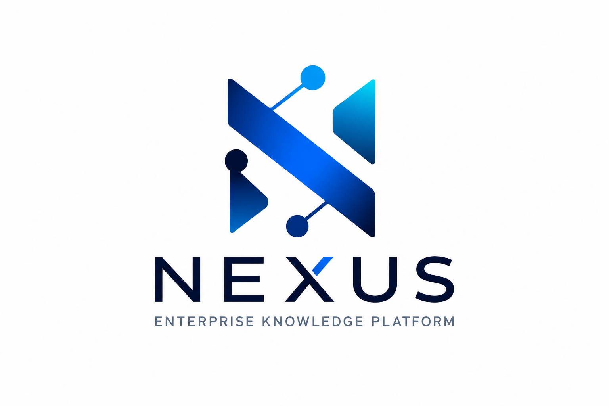
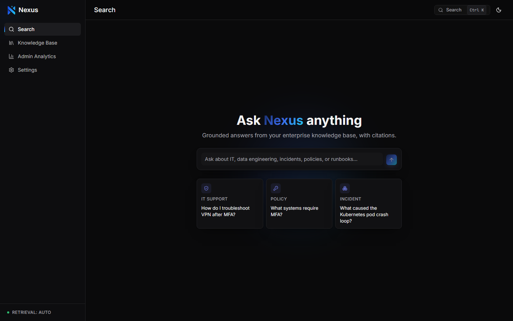
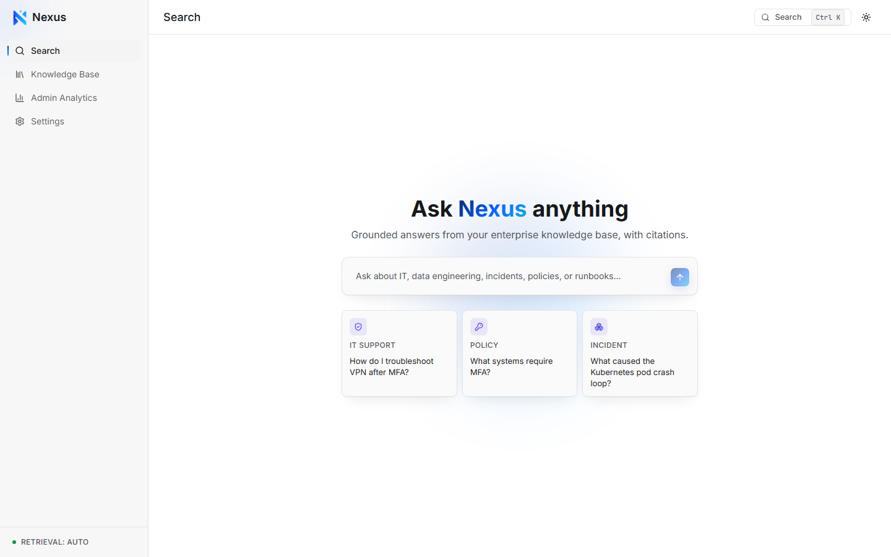
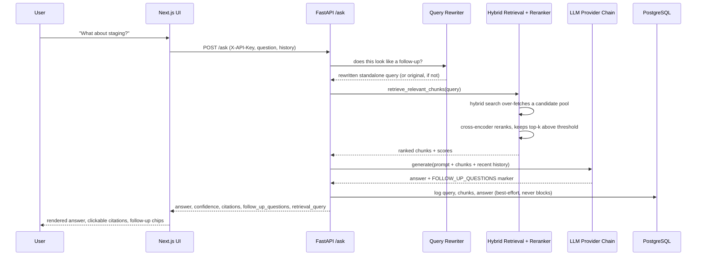

<div align="center">



### Grounded, citation-backed question answering over your organization's internal knowledge.

Hybrid retrieval + cross-encoder reranking + multi-provider LLM generation, wrapped in a
production FastAPI backend and a Next.js console — with an evaluation harness that proves
the retrieval actually works instead of just claiming it does.

[](pyproject.toml)
[](api/main.py)
[](web/package.json)
[](web/package.json)
[](database/schema.sql)
[](docker-compose.yml)
[](docker-compose.yml)
[](tests/)
[](pyproject.toml)
[](LICENSE)

[Quick Start](#-quick-start) •
[Architecture](#-architecture) •
[Screenshots](#-screenshots) •
[API Docs](#-api-reference) •
[Evaluation](#-performance--evaluation) •
[Roadmap](#-roadmap)

</div>

<br />

> [!NOTE]
> **What this project actually is.** Nexus is a real, working RAG (Retrieval-Augmented
> Generation) system — not a slide deck. Every number in this README comes from the
> repository's own test suite, evaluation harness, or live UI. It does **not** implement
> multi-tenant auth, SSO, or a compliance certification, and this README says so explicitly
> in the [Security](#-security-considerations) section rather than implying otherwise.

<br />

## Table of Contents

<details open>
<summary>Click to expand</summary>

- [Why Nexus](#-why-nexus)
- [Feature Highlights](#-feature-highlights)
- [Screenshots](#-screenshots)
- [Architecture](#-architecture)
- [Tech Stack](#-tech-stack)
- [Project Structure](#-project-structure)
- [Quick Start](#-quick-start)
- [Configuration](#-configuration)
- [The RAG Pipeline, Explained](#-the-rag-pipeline-explained)
- [API Reference](#-api-reference)
- [Conversational Example](#-conversational-example)
- [Performance & Evaluation](#-performance--evaluation)
- [Testing & Code Quality](#-testing--code-quality)
- [Security Considerations](#-security-considerations)
- [Roadmap](#-roadmap)
- [Troubleshooting & FAQ](#-troubleshooting--faq)
- [Contributing](#-contributing)
- [Acknowledgements](#-acknowledgements)
- [License](#-license)
- [Contact](#-contact)

</details>

<br />

## 💡 Why Nexus

Generic chatbots hallucinate when asked about internal IT policy, VPN setup, or incident
runbooks — they simply don't know your organization's documents. Nexus grounds every answer
in your actual knowledge base, and never fabricates a citation:

- **Every answer is sourced.** Each response links back to the exact document chunks used
  to generate it, with a relevance score — not a vague "based on my training data."
- **It says "I don't know" on purpose.** When retrieval doesn't find a confident match, the
  system returns a low-confidence "I do not know" answer instead of guessing — verified at
  **100% correctness** on a held-out unanswerable-question set (see [Evaluation](#-performance--evaluation)).
- **It survives a bad API key or a rate limit.** A six-provider LLM fallback chain
  (Gemini → Groq → OpenRouter → OpenAI → Anthropic → deterministic mock) means `/ask` never
  hard-fails just because one provider is down or unconfigured.
- **It works with zero cloud dependencies if you need it to.** No LLM key configured? The
  mock provider still returns a grounded, extractive answer built directly from retrieved
  chunks. No Postgres available? Retrieval falls back to an in-memory keyword search over
  the same corpus.

<br />

## ✨ Feature Highlights

| | |
|---|---|
| 🔎 **Hybrid retrieval** | pgvector cosine similarity fused with PostgreSQL full-text search, with an automatic in-memory keyword fallback if the database is unreachable. |
| 🎯 **Cross-encoder reranking** | A second-stage `sentence-transformers` cross-encoder re-scores an over-fetched candidate pool for precision beyond the first-stage vector/keyword score. |
| 💬 **History-aware follow-ups** | A cheap heuristic gate detects genuine follow-up questions and condenses them (with chat history) into a standalone retrieval query — a self-contained new question skips rewriting entirely. |
| 🔗 **Six-provider LLM fallback chain** | Gemini, Groq, OpenRouter, OpenAI, Ollama, and Anthropic behind one interface, with exponential backoff + `Retry-After` handling, ending in a deterministic mock provider so `/ask` never errors. |
| 📎 **Rich, clickable citations** | Every answer links to the source chunk, its position in the document, and a match percentage — expandable to the full chunk text in a dialog. |
| 💡 **LLM-suggested follow-ups** | Up to three next-question suggestions are parsed from the *same* generation call (a `FOLLOW_UP_QUESTIONS:` marker) — no second round-trip, no extra latency. |
| 📊 **Real admin analytics** | Query volume, latency percentiles, confidence distribution, IDK rate, token/cost totals, and most-cited documents — computed live from Postgres, not mocked. |
| 🐳 **One-command deployment** | `docker compose up` builds and runs the full three-service stack: Postgres + pgvector, FastAPI, and a standalone Next.js server. |
| 🧪 **Reproducible evaluation harness** | `evaluation/run_evaluation.py` measures hit rate, precision/recall@k, and IDK correctness for either retrieval backend — see the real numbers in [Performance & Evaluation](#-performance--evaluation). |
| 🔐 **Server-side-only secrets** | The Next.js app proxies every API call through its own Route Handlers; the API key is attached server-side and never reaches the browser bundle. |

<br />

## 📸 Screenshots

<div align="center">

**Search — empty state, dark & light**




</div>

> [!TIP]
> Screenshots above are captured directly from the live application against a real
> ingested corpus — not mockups.

### 🎥 Demo Video

<div align="center">

## 🎥 Demo

<p align="center">
  <a href="https://github.com/Ridadata/enterprise-rag-assistant/releases/download/v1.0.0/nexus_demo.mp4">
    
  </a>
</p>

<p align="center">
  <b>▶️ Click the image above to watch the full demo.</b>
</p>

</div>

<br />

## 🏗 Architecture


<details>
<summary><b>Request sequence for a conversational follow-up</b> (click to expand)</summary>



</details>

For the full narrative — including exactly which files implement each step — see
[`docs/architecture.md`](docs/architecture.md).

<br />

## 🧰 Tech Stack

<table>
<tr><th>Layer</th><th>Technology</th></tr>
<tr>
<td><b>Frontend</b></td>
<td>

Next.js 16 (App Router) · React 19 · TypeScript · Tailwind CSS v4 · shadcn/ui (Base UI) ·
Framer Motion · TanStack Query · Recharts · react-markdown · next-themes

</td>
</tr>
<tr>
<td><b>Backend</b></td>
<td>

FastAPI · Pydantic v2 / pydantic-settings · Uvicorn · SQLAlchemy 2.0 · psycopg 3

</td>
</tr>
<tr>
<td><b>Data & Retrieval</b></td>
<td>

PostgreSQL 16 · pgvector · PostgreSQL full-text search · sentence-transformers
(bi-encoder embeddings + cross-encoder reranking)

</td>
</tr>
<tr>
<td><b>Generation</b></td>
<td>

Google Gemini · Groq · OpenRouter · OpenAI · Ollama (local) · Anthropic — unified behind
one `ProviderChain` interface

</td>
</tr>
<tr>
<td><b>Infra & Tooling</b></td>
<td>

Docker & Docker Compose · pytest · Ruff · npm

</td>
</tr>
</table>

<br />

## 📁 Project Structure

```text
.
├── api/                    # FastAPI app: routes, schemas, security, services
│   ├── routes/             #   ask.py, admin.py, corpus.py
│   ├── schemas/             #   Pydantic request/response models
│   └── services/            #   rag_service.py (orchestrates retrieval + generation + logging)
├── retrieval/              # Hybrid pgvector+FTS search, local keyword fallback, reranker
├── generation/             # Prompting, query rewriting, LLM client
│   └── providers/           #   Gemini / Groq / OpenRouter / OpenAI / Ollama / Anthropic / chain
├── ingestion/               # Document validation, chunking, embedding, load-to-Postgres
├── database/                 # Settings (pydantic-settings) + schema.sql
├── evaluation/               # Reproducible retrieval/answer-quality evaluation harness
├── monitoring/                # Admin analytics aggregation queries
├── web/                        # Next.js frontend (App Router, Route Handler API proxy)
│   ├── app/                     #   pages + /api route handlers
│   ├── components/               #   UI components (search, admin, knowledge, layout, shared)
│   ├── hooks/                     #   TanStack Query hooks
│   └── lib/                       #   types.ts, server-api.ts, api-client.ts
├── data/                        # Synthetic enterprise knowledge base (JSONL)
├── docs/                       # architecture.md, evaluation_report.md, data_strategy.md, screenshots/
├── tests/                     # unit + integration tests (pytest)
├── docker/                   # Dockerfile.api, Dockerfile.app
└── docker-compose.yml        # db + api + app, three services
```

<br />

## 🚀 Quick Start

### Option A — Docker Compose (recommended)

Everything — Postgres, the API, and the UI — in one command.

```bash
git clone https://github.com/Ridadata/enterprise-rag-assistant.git
cd enterprise-rag-assistant
cp .env.example .env
# Optional but recommended: add a free Gemini or Groq key to .env for real LLM answers.
# Without one, /ask still works -- it falls back to a deterministic extractive answer.

docker compose up -d --build
```

Then load the sample corpus (ingestion runs from a local Python environment, against the
containerized database):

```bash
pip install -e ".[embeddings]"
python -m ingestion.pipelines.load_to_postgres data/synthetic/enterprise_knowledge_base.jsonl --reset
```

| Service | URL |
|---|---|
| Web UI | http://localhost:3000 |
| API | http://localhost:8000 |
| API docs (Swagger) | http://localhost:8000/docs |
| Postgres | `localhost:5433` (mapped from container port 5432) |

### Option B — Local development

<details>
<summary>Backend (FastAPI) + containerized Postgres only</summary>

```bash
# 1. Start just the database
docker compose up -d db

# 2. Install backend dependencies (editable install, with embeddings extra)
python -m venv .venv
.venv\Scripts\activate
pip install -e ".[dev,embeddings]"

# 3. Configure environment
cp .env.example .env   # defaults already match the docker-compose db service

# 4. Ingest the sample corpus
python -m ingestion.pipelines.load_to_postgres data/synthetic/enterprise_knowledge_base.jsonl --reset

# 5. Run the API with auto-reload
uvicorn api.main:app --reload
```

</details>

<details>
<summary>Frontend (Next.js) against a running API</summary>

```bash
cd web
npm install
cp .env.local.example .env.local   # set NEXUS_API_BASE_URL + NEXUS_API_KEY
npm run dev
```

The UI proxies every request through its own server-side Route Handlers
(`web/app/api/*/route.ts`) — the API key is attached there and never shipped to the
browser.

</details>

<br />

## ⚙️ Configuration

All configuration lives in `.env` (see [`.env.example`](.env.example) for the full,
commented reference — this table summarizes the groups that matter most when getting
started).

<details>
<summary><b>Core & Database</b></summary>

| Variable | Default | Purpose |
|---|---|---|
| `API_KEYS` / `API_KEY` | `dev-demo-key` | Shared secret(s) accepted by protected endpoints; `API_KEY` is what the Next.js proxy sends. |
| `POSTGRES_HOST/PORT/DB/USER/PASSWORD` | see `.env.example` | Postgres connection (host port `5433` to avoid colliding with a native Postgres install on `5432`). |
| `DATABASE_URL` | derived | Full SQLAlchemy connection string. |
| `EMBEDDING_PROVIDER` | `sentence_transformers` | `sentence_transformers` (real embeddings) or `hash` (fast/offline stub). |
| `MIN_RETRIEVAL_SCORE` | `0.5` | Similarity floor below which a chunk isn't considered a match. |
| `RAG_RETRIEVAL_BACKEND` | `auto` | `auto` (hybrid, falling back to local keyword search), `postgres` (hard-fail, no fallback), or `local`. |

</details>

<details>
<summary><b>Reranking & Query Rewriting</b></summary>

| Variable | Default | Purpose |
|---|---|---|
| `RERANK_ENABLED` | `true` | Enables the cross-encoder second-pass reranker. |
| `RERANK_MODEL` | `cross-encoder/ms-marco-MiniLM-L-6-v2` | Cross-encoder model used to re-score candidates. |
| `RERANK_CANDIDATE_POOL` | `20` | Size of the over-fetched pool handed to the reranker. |
| `RERANK_MIN_SCORE` | `0.2` | Floor below which a reranked chunk is dropped. |
| `QUERY_REWRITE_ENABLED` | `true` | Enables history-aware follow-up query rewriting. |
| `QUERY_REWRITE_TIMEOUT_SECONDS` | `6.0` | Tight timeout so a slow rewrite can't double follow-up latency. |
| `MAX_HISTORY_TURNS` | `6` | Number of prior turns considered for rewriting/generation. |

</details>

<details>
<summary><b>LLM Providers</b></summary>

| Variable | Default | Purpose |
|---|---|---|
| `LLM_PROVIDERS` | `auto` | Ordered fallback chain. `auto` tries every provider with a key set (Gemini → Groq → OpenRouter → OpenAI → Anthropic) and always ends in `mock`. |
| `LLM_MAX_RETRIES` / `LLM_RETRY_BASE_DELAY` / `LLM_TIMEOUT_SECONDS` | `1` / `0.5` / `10.0` | Retry/backoff behavior per provider. |
| `GEMINI_API_KEY` / `GEMINI_MODEL` | — / `gemini-flash-latest` | [Free key →](https://aistudio.google.com/apikey) |
| `GROQ_API_KEY` / `GROQ_MODEL` | — / `llama-3.3-70b-versatile` | [Free key →](https://console.groq.com/keys) |
| `OPENROUTER_API_KEY` / `OPENROUTER_MODEL` | — / `meta-llama/llama-3.3-70b-instruct:free` | |
| `OPENAI_API_KEY` / `OPENAI_MODEL` | — / `gpt-4o-mini` | |
| `OLLAMA_MODEL` / `OLLAMA_BASE_URL` | `llama3.1` / `http://localhost:11434/v1` | Local only — never auto-activated by `LLM_PROVIDERS=auto`. |
| `ANTHROPIC_API_KEY` / `ANTHROPIC_MODEL` | — / `claude-sonnet-5` | |

</details>

> [!IMPORTANT]
> No LLM key configured at all is a **supported** state, not a misconfiguration — the
> chain ends in a deterministic mock provider that builds an extractive answer straight
> from retrieved chunks, so `/ask` always returns something grounded.

<br />

## 🔬 The RAG Pipeline, Explained

**Auth → rewrite (conditional) → hybrid retrieval → rerank (conditional) → generate → respond → log.**

- A question with prior turns is rewritten into a standalone query only if it actually
  looks like a follow-up — a self-contained question skips straight to retrieval.
- Retrieval fuses pgvector cosine similarity with PostgreSQL full-text search, falling
  back to local in-memory keyword search if Postgres is unreachable.
- An over-fetched candidate pool is reranked by a cross-encoder for precision beyond the
  first-stage score.
- The final response's **confidence is derived from the reranked score, not LLM
  self-assessment**, and includes citations, up to three suggested follow-ups, and the
  actual retrieval query used — all from one generation call, logged to Postgres
  best-effort.

Full detail, file-by-file: [`docs/architecture.md`](docs/architecture.md).

<br />

## 📡 API Reference

Interactive Swagger docs are available at `/docs` on any running instance. All endpoints
except `/health` require an `X-API-Key` header.

<details>
<summary><b>POST /ask</b> — ask a grounded question</summary>

```bash
curl -X POST http://localhost:8000/ask \
  -H "Content-Type: application/json" \
  -H "X-API-Key: dev-demo-key" \
  -d '{
        "question": "How do I connect to the corporate VPN?",
        "history": []
      }'
```

```json
{
  "answer": "Install the Cisco AnyConnect client and connect to vpn.company.com using your corporate credentials plus an MFA code from Duo...",
  "confidence": "high",
  "limitations": "This guidance covers the standard VPN client; contact IT for split-tunnel exceptions.",
  "next_step": "If the connection fails, verify your Duo MFA is enrolled.",
  "follow_up_questions": [
    "What do I do if the VPN client fails to connect?",
    "How do I enroll in Duo MFA?"
  ],
  "retrieval_query": "How do I connect to the corporate VPN?",
  "sources": [
    {
      "title": "VPN Setup Guide",
      "chunk_id": "vpn-setup-guide::3",
      "chunk_position": 3,
      "excerpt": "...",
      "score": 0.91
    }
  ]
}
```

Errors: `401` (missing/invalid API key) · `503` (`RetrievalBackendUnavailable`, e.g.
`RAG_RETRIEVAL_BACKEND=postgres` with the DB down) · `500` (unexpected failure).

</details>

<details>
<summary><b>GET /corpus/summary</b> — knowledge base stats</summary>

```bash
curl http://localhost:8000/corpus/summary -H "X-API-Key: dev-demo-key"
```

Returns live document/chunk counts and a source-type breakdown, read directly from
Postgres. Errors: `401` · `503` (`CorpusUnavailable`).

</details>

<details>
<summary><b>GET /admin/summary</b> — usage & quality analytics</summary>

```bash
curl http://localhost:8000/admin/summary -H "X-API-Key: dev-demo-key"
```

Returns query volume, latency percentiles, confidence distribution, IDK rate, token/cost
totals, and most-cited/never-retrieved documents — computed live from the
`queries`/`answers`/`retrieved_contexts` tables. Errors: `401` · `503`
(`AdminSummaryUnavailable`).

</details>

<details>
<summary><b>GET /health</b> — liveness probe (no auth)</summary>

```bash
curl http://localhost:8000/health
# {"status": "ok"}
```

</details>

<br />

## 💬 Conversational Example

Nexus resolves pronouns and implicit references across turns by rewriting genuine
follow-ups into standalone retrieval queries — without paying that cost on
self-contained questions.

```text
▸ You:     What's the process for requesting new software?
▸ Nexus:   Submit a request through the IT Service Portal under "Software Requests"...
           [Sources: Software Request Policy §2]

▸ You:     How long does that usually take?
           (rewritten internally to: "How long does the software request approval
            process usually take?" -- because it looks like a follow-up)
▸ Nexus:   Standard requests are typically approved within 2 business days...
           [Sources: Software Request Policy §4]
           Suggested: "What if my request is denied?" · "Who approves these requests?"
```

<br />

## 📈 Performance & Evaluation

Measured with [`evaluation/run_evaluation.py`](evaluation/run_evaluation.py) against 100
answerable questions (drawn from each document's own `expected_questions`) plus 5
deliberately unanswerable ones, `top_k=5`. Full methodology and raw numbers:
[`docs/evaluation_report.md`](docs/evaluation_report.md).

| Metric | Local (keyword fallback) | Postgres (hybrid + rerank) |
|---|---:|---:|
| Expected-source hit rate | 49.0% | **91.0%** |
| Mean precision@5 | 0.098 | 0.183 |
| Mean recall@5 | 0.49 | **0.91** |
| "I do not know" correctness | 99.1% | **100%** |
| p95 latency | 25.3 ms | 92.4 ms |

> [!NOTE]
> Mean latency for the Postgres backend (265.6 ms) is skewed by one-time model loading on
> the first request of the run; p95 is the representative figure.

Reproduce it yourself:

```bash
python -m evaluation.run_evaluation \
  --corpus data/synthetic/enterprise_knowledge_base.jsonl \
  --limit 100 --backend both --top-k 5
```

<br />

## ✅ Testing & Code Quality

```bash
python -m pytest -q         # 141 tests passing -- unit + integration
ruff check .                 # clean
python -m compileall .       # syntax sanity check across the codebase
```

Test coverage spans retrieval (hybrid search, local fallback, reranker), the full provider
chain (each LLM provider + retry/backoff behavior, mocked at the HTTP boundary), query
rewriting, the ingestion checksum-skip logic, and every API route's auth/error branches.

<br />

## 🔐 Security Considerations

Nexus is built with production-grade *engineering practices* — but it is honest about what
it is not. This section states both plainly.

**What's real:**
- Every protected endpoint (`/ask`, `/corpus/summary`, `/admin/summary`) requires an
  `X-API-Key` header, checked before any retrieval or generation work runs.
- The Next.js app never exposes the API key to the browser — it's attached server-side by
  the app's own Route Handlers, which are the only thing that talks to FastAPI directly.
- Secrets live in a git-ignored `.env`, never committed; `.env.example` documents every
  variable with no real values.
- LLM provider calls fail closed into retries and, ultimately, a deterministic offline
  answer — a provider outage can't turn into leaked internal state or a crash.

**What this is not (yet):**
- **Not multi-tenant.** Authentication is a shared secret, not per-user accounts, roles, or
  SSO — every caller with the key has the same access to the same corpus.
- **Not SOC 2 / HIPAA / compliance-certified.** No such certification is claimed anywhere
  in this project.
- **No rate limiting or WAF** in front of the API by default — put a reverse proxy in
  front of it for anything internet-facing.
- **No audit log of *who* asked what** beyond the optional free-text `user_id` label sent
  by the client — see [Roadmap](#-roadmap) for real per-user auth.

<br />

## 🗺 Roadmap

Deliberately out of scope today, tracked in [`project_plan.md`](project_plan.md) and
[`docs/architecture.md`](docs/architecture.md):

- [ ] **Feedback capture** — the `feedback` table exists in the schema; nothing writes to
      it yet.
- [ ] **LLM-judge evaluation** — automated faithfulness/hallucination scoring on top of the
      existing retrieval-quality harness.
- [ ] **Persisted conversation history** — history is currently client-sent per request
      (`ConversationTurn` in `api/schemas/qa.py`), not stored or resumable server-side.
- [ ] **Document viewer** with chunk highlighting (needs a document-content endpoint).
- [ ] **Knowledge collections / tagging** and a browsable document list.
- [ ] **Bookmarks** for saved answers.
- [ ] **Real per-user auth** (roles/accounts) to replace the shared-key model.
- [ ] **Incident / CVE / document-comparison** assistant modes.
- [ ] Token-streaming `/ask` endpoint — `generate_stream()` already exists on every LLM
      provider and the chain itself; nothing calls it yet.

<br />

## 🛠 Troubleshooting & FAQ

<details>
<summary><b>Docker Compose can't reach Postgres on port 5432</b></summary>

A native PostgreSQL Windows service commonly binds host port 5432 and silently intercepts
traffic meant for the `db` container. This project maps the container to **host port
5433** specifically to avoid that collision (`DATABASE_URL` in `.env.example` already
points at `5433`) — don't change it back to 5432 unless you've stopped the native service.

</details>

<details>
<summary><b>Gemini requests fail with a "model not found" / deprecation error</b></summary>

Google periodically retires dated Gemini model snapshots. This project pins
`GEMINI_MODEL=gemini-flash-latest` (a rolling alias) specifically to avoid that — if
you've overridden it to a dated model name, switch back to `gemini-flash-latest` or
another current model from Google's docs.

</details>

<details>
<summary><b>Do I need an LLM API key to try this?</b></summary>

No. Without any provider key configured, `/ask` still returns a grounded, extractive
answer built directly from retrieved chunks via the mock provider — useful for verifying
retrieval quality before wiring up a real model.

</details>

<br />

## 🤝 Contributing

Contributions are welcome. Before opening a PR:

1. `pip install -e ".[dev,embeddings]"` and `cd web && npm install`.
2. Make your change, then run `python -m pytest -q` and `ruff check .` — both must pass.
3. For frontend changes, run `npm run build` in `web/` (type errors fail the build) and
   manually verify the affected page in both light and dark themes.
4. Keep PRs focused — one logical change per PR, with a description of *why*, not just
   *what*.

<br />

## 🙏 Acknowledgements

Built on the shoulders of excellent open-source projects: [FastAPI](https://fastapi.tiangolo.com/),
[Next.js](https://nextjs.org/), [pgvector](https://github.com/pgvector/pgvector),
[sentence-transformers](https://www.sbert.net/), [shadcn/ui](https://ui.shadcn.com/),
[Base UI](https://base-ui.com/), [TanStack Query](https://tanstack.com/query),
[Recharts](https://recharts.org/), and [Framer Motion](https://www.framer.com/motion/).

<br />

## 📄 License

Released under the [MIT License](LICENSE) — Copyright © 2026 Ridadata.

<br />

## 📬 Contact

Questions, bug reports, or feature requests: please
[open an issue](https://github.com/Ridadata/enterprise-rag-assistant/issues) on this
repository.

<div align="center">

<sub>Built by <a href="https://github.com/Ridadata">Ridadata</a></sub>

</div>
</content>
