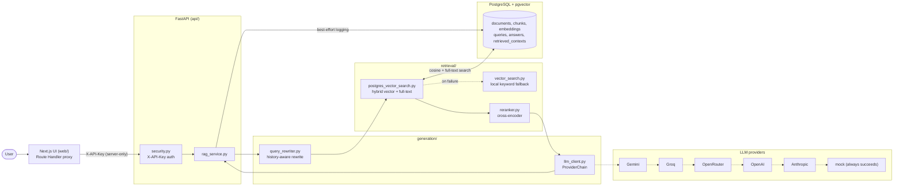
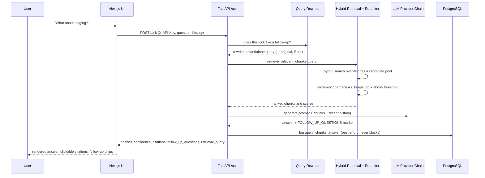

# Nexus

Grounded, citation-backed question answering over an organization's internal knowledge base.
Hybrid retrieval, cross-encoder reranking, and multi-provider LLM generation behind a FastAPI
backend and a Next.js console, with an evaluation harness that measures retrieval quality
rather than just asserting it.

[](LICENSE)
[](https://github.com/Ridadata/enterprise-rag-assistant/commits/main)
[](https://github.com/Ridadata/enterprise-rag-assistant/stargazers)

## Overview

Generic chatbots have no knowledge of an organization's internal documents — IT policy, VPN
setup, incident runbooks — and will confidently guess anyway. Nexus retrieves the relevant
document chunks first and grounds every answer in them: each response cites its sources, and
when retrieval doesn't find a confident match, the system says "I do not know" instead of
guessing (100% correctness on a held-out unanswerable-question set — see
[Performance & Evaluation](#performance--evaluation)).

Generation runs through an ordered fallback chain across six LLM providers, ending in a
deterministic mock provider, so a missing or rate-limited API key never breaks `/ask`. If
Postgres is unreachable, retrieval falls back to an in-memory keyword search over the same
corpus. Both fallbacks are real, tested code paths, not aspirational.

## Contents

- [Features](#features)
- [Screenshots](#screenshots)
- [Architecture](#architecture)
- [Tech stack](#tech-stack)
- [Project structure](#project-structure)
- [Quick start](#quick-start)
- [Configuration](#configuration)
- [The RAG pipeline](#the-rag-pipeline)
- [API reference](#api-reference)
- [Conversational example](#conversational-example)
- [Performance & evaluation](#performance--evaluation)
- [Testing & code quality](#testing--code-quality)
- [Security](#security)
- [Roadmap](#roadmap)
- [Troubleshooting](#troubleshooting)
- [Contributing](#contributing)
- [Acknowledgements](#acknowledgements)
- [License](#license)

## Features

- **Hybrid retrieval** — pgvector cosine similarity fused with PostgreSQL full-text search,
  with an automatic in-memory keyword fallback if the database is unreachable.
- **Cross-encoder reranking** — a second-stage `sentence-transformers` cross-encoder re-scores
  an over-fetched candidate pool for precision beyond the first-stage score.
- **History-aware follow-ups** — a heuristic gate detects genuine follow-up questions and
  condenses them, with chat history, into a standalone retrieval query. A self-contained
  question skips rewriting entirely.
- **Multi-provider LLM fallback chain** — Gemini, Groq, OpenRouter, OpenAI, Ollama, and
  Anthropic behind one interface, retried with backoff, ending in a deterministic mock
  provider so `/ask` never errors out.
- **Clickable citations** — every answer links to the source chunk, its position in the
  document, and a match score, expandable to the full chunk text.
- **Suggested follow-ups** — up to three next-question suggestions parsed from the same
  generation call, at no extra latency cost.
- **Admin analytics** — query volume, latency percentiles, confidence distribution, IDK rate,
  token/cost totals, and most-cited documents, computed live from Postgres.
- **One-command deployment** — `docker compose up` runs the full stack: Postgres with
  pgvector, the FastAPI backend, and a standalone Next.js server.
- **Reproducible evaluation** — `evaluation/run_evaluation.py` reports hit rate,
  precision/recall@k, and IDK correctness for either retrieval backend.

## Screenshots

| Search — dark | Search — light |
|---|---|
|  |  |

Screenshots are captured from the live application against a real ingested corpus.

### Demo

A short walkthrough is available as a downloadable recording:
[nexus_demo.mp4](https://github.com/Ridadata/enterprise-rag-assistant/releases/download/v1.0.0/nexus_demo.mp4)
(also committed at [`docs/nexus_demo.mp4`](docs/nexus_demo.mp4)).

## Architecture



<details>
<summary>Request sequence for a conversational follow-up</summary>



</details>

The full narrative, file by file, is in [`docs/architecture.md`](docs/architecture.md).

## Tech stack

| Layer | Technologies |
|---|---|
| Frontend | Next.js 16 (App Router), React 19, TypeScript, Tailwind CSS v4, shadcn/ui (Base UI), TanStack Query, Recharts |
| Backend | FastAPI, Pydantic v2 / pydantic-settings, Uvicorn, SQLAlchemy 2.0, psycopg 3 |
| Data & retrieval | PostgreSQL 16, pgvector, PostgreSQL full-text search, sentence-transformers |
| Generation | Gemini, Groq, OpenRouter, OpenAI, Ollama, Anthropic behind one provider-chain interface |
| Infra & tooling | Docker Compose, pytest, Ruff, npm |

## Project structure

```text
.
├── api/                # FastAPI app: routes, schemas, security, services
│   ├── routes/          #   ask.py, admin.py, corpus.py
│   ├── schemas/         #   Pydantic request/response models
│   └── services/        #   rag_service.py -- orchestrates retrieval, generation, logging
├── retrieval/          # Hybrid pgvector+FTS search, local keyword fallback, reranker
├── generation/         # Prompting, query rewriting, LLM client
│   └── providers/       #   Gemini, Groq, OpenRouter, OpenAI, Ollama, Anthropic, chain
├── ingestion/           # Document validation, chunking, embedding, load-to-Postgres
├── database/            # Settings (pydantic-settings) and schema.sql
├── evaluation/          # Retrieval and answer-quality evaluation harness
├── monitoring/          # Admin analytics aggregation queries
├── web/                 # Next.js frontend (App Router, Route Handler API proxy)
│   ├── app/              #   pages and /api route handlers
│   ├── components/       #   UI components
│   ├── hooks/            #   TanStack Query hooks
│   └── lib/              #   types.ts, server-api.ts, api-client.ts
├── data/                # Synthetic enterprise knowledge base (JSONL)
├── docs/                # architecture.md, evaluation_report.md, screenshots/
├── tests/               # Unit and integration tests (pytest)
├── docker/              # Dockerfile.api, Dockerfile.app
└── docker-compose.yml   # db, api, app services
```

## Quick start

### Docker Compose (recommended)

```bash
git clone https://github.com/Ridadata/enterprise-rag-assistant.git
cd enterprise-rag-assistant
cp .env.example .env
docker compose up -d --build
```

A Gemini or Groq key in `.env` is optional but recommended for real LLM answers — without
one, `/ask` still works, falling back to a deterministic extractive answer. Then load the
sample corpus (ingestion runs from a local Python environment, against the containerized
database):

```bash
pip install -e ".[embeddings]"
python -m ingestion.pipelines.load_to_postgres data/synthetic/enterprise_knowledge_base.jsonl --reset
```

| Service | URL |
|---|---|
| Web UI | http://localhost:3000 |
| API | http://localhost:8000 |
| API docs (Swagger) | http://localhost:8000/docs |
| Postgres | `localhost:5433` (mapped from container port 5432) |

### Local development

<details>
<summary>Backend — FastAPI with a containerized Postgres</summary>

```bash
docker compose up -d db

python -m venv .venv
.venv\Scripts\activate
pip install -e ".[dev,embeddings]"

cp .env.example .env   # defaults already match the docker-compose db service

python -m ingestion.pipelines.load_to_postgres data/synthetic/enterprise_knowledge_base.jsonl --reset

uvicorn api.main:app --reload
```

</details>

<details>
<summary>Frontend — Next.js against a running API</summary>

```bash
cd web
npm install
cp .env.local.example .env.local   # set NEXUS_API_BASE_URL and NEXUS_API_KEY
npm run dev
```

The UI proxies every request through its own server-side Route Handlers
(`web/app/api/*/route.ts`); the API key is attached there and never shipped to the browser.

</details>

## Configuration

All configuration lives in `.env` — see [`.env.example`](.env.example) for the full,
commented reference. The tables below summarize the groups that matter most when getting
started.

<details>
<summary>Core & database</summary>

| Variable | Default | Purpose |
|---|---|---|
| `API_KEYS` / `API_KEY` | `dev-demo-key` | Shared secret(s) accepted by protected endpoints; `API_KEY` is what the Next.js proxy sends. |
| `POSTGRES_HOST/PORT/DB/USER/PASSWORD` | see `.env.example` | Postgres connection (host port `5433` to avoid colliding with a native Postgres install on `5432`). |
| `DATABASE_URL` | derived | Full SQLAlchemy connection string. |
| `EMBEDDING_PROVIDER` | `sentence_transformers` | `sentence_transformers` (real embeddings) or `hash` (fast/offline stub). |
| `MIN_RETRIEVAL_SCORE` | `0.5` | Similarity floor below which a chunk isn't considered a match. |
| `RAG_RETRIEVAL_BACKEND` | `auto` | `auto` (hybrid, falls back to local keyword search), `postgres` (hard-fail, no fallback), or `local`. |

</details>

<details>
<summary>Reranking & query rewriting</summary>

| Variable | Default | Purpose |
|---|---|---|
| `RERANK_ENABLED` | `true` | Enables the cross-encoder second-pass reranker. |
| `RERANK_MODEL` | `cross-encoder/ms-marco-MiniLM-L-6-v2` | Cross-encoder model used to re-score candidates. |
| `RERANK_CANDIDATE_POOL` | `20` | Size of the over-fetched pool handed to the reranker. |
| `RERANK_MIN_SCORE` | `0.2` | Floor below which a reranked chunk is dropped. |
| `QUERY_REWRITE_ENABLED` | `true` | Enables history-aware follow-up query rewriting. |
| `QUERY_REWRITE_TIMEOUT_SECONDS` | `6.0` | Tight timeout so a slow rewrite can't double follow-up latency. |
| `MAX_HISTORY_TURNS` | `6` | Number of prior turns considered for rewriting and generation. |

</details>

<details>
<summary>LLM providers</summary>

| Variable | Default | Purpose |
|---|---|---|
| `LLM_PROVIDERS` | `auto` | Ordered fallback chain. `auto` tries every provider with a key set (Gemini, Groq, OpenRouter, OpenAI, Anthropic) and always ends in `mock`. |
| `LLM_MAX_RETRIES` / `LLM_RETRY_BASE_DELAY` / `LLM_TIMEOUT_SECONDS` | `1` / `0.5` / `10.0` | Retry/backoff behavior per provider. |
| `GEMINI_API_KEY` / `GEMINI_MODEL` | — / `gemini-flash-latest` | Free key: https://aistudio.google.com/apikey |
| `GROQ_API_KEY` / `GROQ_MODEL` | — / `llama-3.3-70b-versatile` | Free key: https://console.groq.com/keys |
| `OPENROUTER_API_KEY` / `OPENROUTER_MODEL` | — / `meta-llama/llama-3.3-70b-instruct:free` | |
| `OPENAI_API_KEY` / `OPENAI_MODEL` | — / `gpt-4o-mini` | |
| `OLLAMA_MODEL` / `OLLAMA_BASE_URL` | `llama3.1` / `http://localhost:11434/v1` | Local only, never auto-activated by `LLM_PROVIDERS=auto`. |
| `ANTHROPIC_API_KEY` / `ANTHROPIC_MODEL` | — / `claude-sonnet-5` | |

</details>

No LLM key configured is a supported state, not a misconfiguration: the chain ends in a
deterministic mock provider that builds an extractive answer straight from retrieved chunks,
so `/ask` always returns something grounded.

## The RAG pipeline

Auth → rewrite (conditional) → hybrid retrieval → rerank (conditional) → generate → respond → log.

- A question with prior turns is rewritten into a standalone query only if it actually looks
  like a follow-up; a self-contained question skips straight to retrieval.
- Retrieval fuses pgvector cosine similarity with PostgreSQL full-text search, falling back to
  local in-memory keyword search if Postgres is unreachable.
- An over-fetched candidate pool is reranked by a cross-encoder for precision beyond the
  first-stage score.
- The response's confidence is derived from the reranked score, not LLM self-assessment, and
  includes citations, up to three suggested follow-ups, and the actual retrieval query used —
  all from one generation call, logged to Postgres best-effort.

Full detail, file by file: [`docs/architecture.md`](docs/architecture.md).

## API reference

Interactive Swagger docs are available at `/docs` on any running instance. All endpoints
except `/health` require an `X-API-Key` header.

<details>
<summary><code>POST /ask</code> — ask a grounded question</summary>

```bash
curl -X POST http://localhost:8000/ask \
  -H "Content-Type: application/json" \
  -H "X-API-Key: dev-demo-key" \
  -d '{
        "question": "How do I connect to the corporate VPN?",
        "history": []
      }'
```

```json
{
  "answer": "Install the Cisco AnyConnect client and connect to vpn.company.com using your corporate credentials plus an MFA code from Duo...",
  "confidence": "high",
  "limitations": "This guidance covers the standard VPN client; contact IT for split-tunnel exceptions.",
  "next_step": "If the connection fails, verify your Duo MFA is enrolled.",
  "follow_up_questions": [
    "What do I do if the VPN client fails to connect?",
    "How do I enroll in Duo MFA?"
  ],
  "retrieval_query": "How do I connect to the corporate VPN?",
  "sources": [
    {
      "title": "VPN Setup Guide",
      "chunk_id": "vpn-setup-guide::3",
      "chunk_position": 3,
      "excerpt": "...",
      "score": 0.91
    }
  ]
}
```

Errors: `401` (missing/invalid API key), `503` (`RetrievalBackendUnavailable`, e.g.
`RAG_RETRIEVAL_BACKEND=postgres` with the database down), `500` (unexpected failure).

</details>

<details>
<summary><code>GET /corpus/summary</code> — knowledge base stats</summary>

```bash
curl http://localhost:8000/corpus/summary -H "X-API-Key: dev-demo-key"
```

Returns live document/chunk counts and a source-type breakdown, read directly from Postgres.
Errors: `401`, `503` (`CorpusUnavailable`).

</details>

<details>
<summary><code>GET /admin/summary</code> — usage and quality analytics</summary>

```bash
curl http://localhost:8000/admin/summary -H "X-API-Key: dev-demo-key"
```

Returns query volume, latency percentiles, confidence distribution, IDK rate, token/cost
totals, and most-cited/never-retrieved documents, computed live from the
`queries`/`answers`/`retrieved_contexts` tables. Errors: `401`, `503`
(`AdminSummaryUnavailable`).

</details>

<details>
<summary><code>GET /health</code> — liveness probe (no auth)</summary>

```bash
curl http://localhost:8000/health
# {"status": "ok"}
```

</details>

## Conversational example

Nexus resolves pronouns and implicit references across turns by rewriting genuine follow-ups
into standalone retrieval queries, without paying that cost on self-contained questions.

```text
You:    What's the process for requesting new software?
Nexus:  Submit a request through the IT Service Portal under "Software Requests"...
        Sources: Software Request Policy, section 2

You:    How long does that usually take?
        (rewritten internally to "How long does the software request approval process
         usually take?" because it looks like a follow-up)
Nexus:  Standard requests are typically approved within 2 business days...
        Sources: Software Request Policy, section 4
        Suggested: "What if my request is denied?" / "Who approves these requests?"
```

## Performance & evaluation

Measured with [`evaluation/run_evaluation.py`](evaluation/run_evaluation.py) against 100
answerable questions (drawn from each document's own `expected_questions`) plus 5 deliberately
unanswerable ones, `top_k=5`. Full methodology and raw numbers:
[`docs/evaluation_report.md`](docs/evaluation_report.md).

| Metric | Local (keyword fallback) | Postgres (hybrid + rerank) |
|---|---:|---:|
| Expected-source hit rate | 49.0% | 91.0% |
| Mean precision@5 | 0.098 | 0.183 |
| Mean recall@5 | 0.49 | 0.91 |
| "I do not know" correctness | 99.1% | 100% |
| p95 latency | 25.3 ms | 92.4 ms |

Mean latency for the Postgres backend (265.6 ms) is skewed by one-time model loading on the
first request of the run; p95 is the representative figure.

Reproduce it:

```bash
python -m evaluation.run_evaluation \
  --corpus data/synthetic/enterprise_knowledge_base.jsonl \
  --limit 100 --backend both --top-k 5
```

## Testing & code quality

```bash
python -m pytest -q         # 141 tests passing -- unit and integration
ruff check .                 # clean
python -m compileall .       # syntax sanity check across the codebase
```

Coverage spans retrieval (hybrid search, local fallback, reranker), the full provider chain
(each LLM provider plus retry/backoff behavior, mocked at the HTTP boundary), query
rewriting, the ingestion checksum-skip logic, and every API route's auth/error branches.

## Security

Nexus is built with production-grade engineering practices, but it does not claim features
it doesn't have.

**In place today:**
- Every protected endpoint (`/ask`, `/corpus/summary`, `/admin/summary`) requires an
  `X-API-Key` header, checked before any retrieval or generation work runs.
- The Next.js app never exposes the API key to the browser; it's attached server-side by the
  app's own Route Handlers, the only thing that talks to FastAPI directly.
- Secrets live in a git-ignored `.env`, never committed; `.env.example` documents every
  variable with no real values.
- LLM provider calls fail closed into retries and, ultimately, a deterministic offline
  answer — a provider outage can't leak internal state or crash the request.

**Not implemented:**
- Multi-tenant auth. Authentication is a shared secret, not per-user accounts, roles, or SSO —
  every caller with the key has the same access to the same corpus.
- Any compliance certification (SOC 2, HIPAA, or otherwise).
- Rate limiting or a WAF in front of the API — put a reverse proxy in front of it for anything
  internet-facing.
- An audit log of who asked what, beyond the optional free-text `user_id` label sent by the
  client. See [Roadmap](#roadmap) for real per-user auth.

## Roadmap

Deliberately out of scope today, tracked in [`project_plan.md`](project_plan.md) and
[`docs/architecture.md`](docs/architecture.md):

- [ ] Feedback capture — the `feedback` table exists in the schema; nothing writes to it yet.
- [ ] LLM-judge evaluation — automated faithfulness/hallucination scoring on top of the
      existing retrieval-quality harness.
- [ ] Persisted conversation history — history is currently client-sent per request
      (`ConversationTurn` in `api/schemas/qa.py`), not stored or resumable server-side.
- [ ] Document viewer with chunk highlighting (needs a document-content endpoint).
- [ ] Knowledge collections / tagging and a browsable document list.
- [ ] Bookmarks for saved answers.
- [ ] Real per-user auth (roles/accounts) to replace the shared-key model.
- [ ] Incident / CVE / document-comparison assistant modes.
- [ ] Token-streaming `/ask` endpoint — `generate_stream()` already exists on every LLM
      provider and the chain itself; nothing calls it yet.

## Troubleshooting

<details>
<summary>Docker Compose can't reach Postgres on port 5432</summary>

A native PostgreSQL Windows service commonly binds host port 5432 and silently intercepts
traffic meant for the `db` container. This project maps the container to host port 5433
specifically to avoid that collision (`DATABASE_URL` in `.env.example` already points at
`5433`) — don't change it back to 5432 unless the native service is stopped.

</details>

<details>
<summary>Gemini requests fail with a "model not found" / deprecation error</summary>

Google periodically retires dated Gemini model snapshots. This project pins
`GEMINI_MODEL=gemini-flash-latest`, a rolling alias, specifically to avoid that. If it's been
overridden to a dated model name, switch back to `gemini-flash-latest` or another current
model from Google's docs.

</details>

<details>
<summary>Do I need an LLM API key to try this?</summary>

No. Without any provider key configured, `/ask` still returns a grounded, extractive answer
built directly from retrieved chunks via the mock provider — useful for verifying retrieval
quality before wiring up a real model.

</details>

## Contributing

1. `pip install -e ".[dev,embeddings]"` and `cd web && npm install`.
2. Make the change, then run `python -m pytest -q` and `ruff check .` — both must pass.
3. For frontend changes, run `npm run build` in `web/` and verify the affected page in both
   light and dark themes.
4. Keep PRs focused: one logical change per PR, with a description of why, not just what.

## Acknowledgements

Built on [FastAPI](https://fastapi.tiangolo.com/), [Next.js](https://nextjs.org/),
[pgvector](https://github.com/pgvector/pgvector),
[sentence-transformers](https://www.sbert.net/), [shadcn/ui](https://ui.shadcn.com/),
[Base UI](https://base-ui.com/), [TanStack Query](https://tanstack.com/query), and
[Recharts](https://recharts.org/).

## License

Released under the [MIT License](LICENSE). Copyright (c) 2026 Ridadata.

Questions or issues: [open an issue](https://github.com/Ridadata/enterprise-rag-assistant/issues).
</content>
